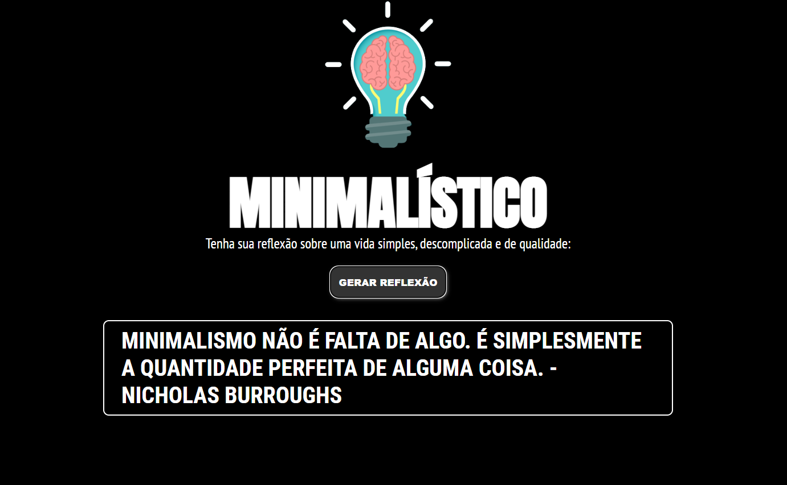

<h1 align="center">MINIMALÍSTICO</h1>

Site gerador de frases minimalista

  <a href="#-tecnologias">Tecnologias</a>&nbsp;&nbsp;&nbsp;|&nbsp;&nbsp;&nbsp;
  <a href="#-projeto">Projeto</a>&nbsp;&nbsp;&nbsp;&nbsp;&nbsp;&nbsp;

 

  

## 🚀 Tecnologias

Esse projeto foi desenvolvido com as seguintes tecnologias:

- HTML e CSS
- JavaScript
- Git e Github

## 💻 Projeto

Desenvolvendo um site gerador de frases, voltado ao estilo de vida minimalista. [Clique aqui para acessar!!!]()
